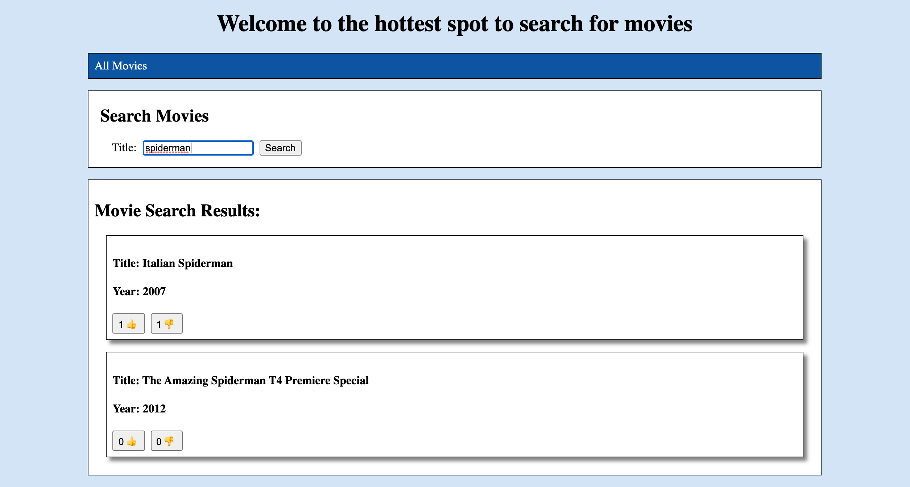
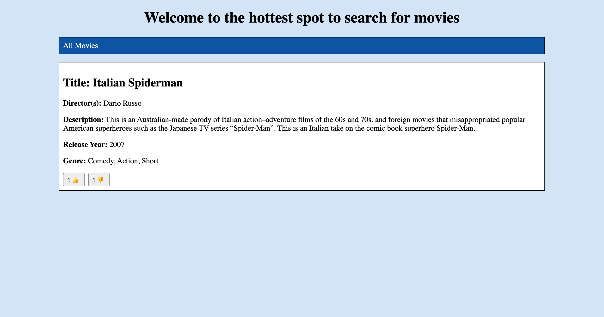

# Year One API Project

Deployed app: https://edward-haddican-year-one-app.herokuapp.com/movies

To run locally:
Run `npm install` and create a database with `createdb year_one_project`

For development, first run `npm run start-server` and then separately run `npm run start-dev` in a different terminal.

React-scripts will load up a dev server on port 3000, but will send API calls to the API server at port 8000, via a proxy.

Photos of the web app:

